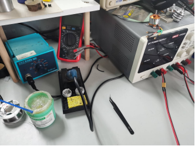

# GKD_HardwareLearning

### 一、入门STM32单片机（C语言编程）
- 首先需要了解整个单片机的开发流程，一些具体细节无需深刻理解，只需要了解大概流程和对应的名词，以及STM32单片机的各类型号，以便后面深入学习时进行更进一步的检索和学习
  - 根据[这个视频](https://www.bilibili.com/video/BV1QD4y1a7kn/?spm_id_from=333.999.0.0&vd_source=3a6242b3cb9435a95f7d4a98159f0607)学习环境配置和编程基础
  - 根据[这个视频](https://www.bilibili.com/video/BV1wA411R7Rx/?spm_id_from=333.999.0.0&vd_source=3a6242b3cb9435a95f7d4a98159f0607)学习单片机的简单知识进行入门：
  - 根据[这个视频](https://www.bilibili.com/video/BV1gP4y1q78s/?spm_id_from=333.999.0.0&vd_source=3a6242b3cb9435a95f7d4a98159f0607)了解原理图和PCB的设计
- 另：我们计划在这个寒假更新这些教程

### 二、熟悉STM32单片机开发（C语言编程）
- 在了解了单片机，外设，UART，中断，IO，原理图，引脚，编译，调试这些词汇和完整的开发流程后，你就可以自己尝试一些纯单片机简单的项目，在这类项目中，你不需要复杂的设备比如电机、摄像头等等，只需要一块开发板和一些简单的传感器和通信的模块就可以完成，具体项目可以使用B站或者CSDN检索，下面是一些简单的例子：
  - 使用DH11模块进行温湿度采集
  - 使用单片机内置的DSP库实现矩阵乘法，求逆等等操作（矩阵是大学课程《线性代数》里的知识，和函数，导数等等都是非常基础和有用的概念，如果想尝试这个项目，可以先简单学习一下矩阵和其基本运算）
  - 矩阵按键及其输入信号的处理（这里的矩阵和前面的矩阵不是一个概念，上网简单查一下即可明白）
  - ......

### 三、熟悉原理图和PCB的设计（使用嘉立创EDA 专业版），掌握焊接技术
- 进行到这一步，你就不能简单的满足于使用购买的模块和开发板进行编程了，你需要自己设计出一块开发板，并在上面运行自己编写的程序。在进行这一步之前，你需要：

  

  - 购买焊台、烙铁头、高温棉、焊锡丝、助焊油、镊子、万用表，直流电源这几种基本设备：
  - 知道贴片与插件的区别，了解除了电容、电感、电阻之外还有很多的元器件，比如单片机芯片、晶振，贴片LED等等
  - 知道在硬件设计中的基本名词：焊盘，过孔，针脚，贴片，SMT，钢网等等
  - 具备基础的焊接知识，可以焊接0603大小的电阻电容以及小封装的芯片

- 之后你就可以进行你的第一个项目了：自己制作一块你在最开始的教程中从网上购买的STM32F103C8T6单片机最小系统板，并将你最开始在网上购买的STM32F103C8T6单片机最小系统板中写的程序复现在你自己制作的开发板上，这里不再给出链接，请在网上自行寻找资料

### 四、熟悉基本的控制理论包括串级控制和PID控制，然后用C语言实现
- 到这里，对pid的理解就不能局限在简单的比例加速响应，积分消除累计误差，微分缓解震荡之上了，你需要了解kp，ki，kd的参数是如何整定的，学会使用一些上位软件查看波形以辅助调参，同时也需要对串级控制有初步的了解，能分清控制器的内环外环

### 五、进阶嵌入式开发（C/C++语言编程）
- 在这里，学习路径将出现分叉，你会发现我的标题从STM32单片机变成了嵌入式，这是因为STM32只是嵌入式中的单片机中的一类而已，我们需要学习更多的内容。以下有多个路径:
  - 数字电源与功率拓扑：这个方向需要熟练掌握MOS管，三极管，运算放大器，DCDC，逆变器等等模拟电路内容，同时对硬件（PCB）设计的要求高，此时画板子不能局限于连连看，而很多地方的走线布局都有很多讲究。
  - FPGA：这是另一中和单片机完全不同的嵌入式芯片，主要应用于数字信号处理（比如视频信号，雷达信号，网络等等）和IC验证，这一块是全新的知识，对数字电路的要求较高，编程工程量巨大且极其困难，调试也很复杂，但是对硬件设计要求不高，大多数情况不需要自己画板子。FPGA更进阶的是ZYNQ，感兴趣可以自己了解。
  - Linux操作系统与嵌入式：这个方向完全不需要画板子了，而是用到了更高级的嵌入式，你也可以理解为电脑，上面也不是运行单纯的程序（我们称之为裸机运行），而是运行了Linux操作系统。在这个方向，你的编程就更像在你得笔记本上进行编程了，你可以买一块Linux开发板比如香橙派，酷派，树莓派，jetson nano，NX等等，而他们的性能也允许你能够在其上通过调用其他人编写的库来运行一些更高级的算法，比如复杂的迭代矩阵运算，神经网络等等。
  - 运动控制算法与信号处理：这个方向重点在于在有限的单片机资源下，掌握经典控制和信号处理方法（前者包括对实体的运动学建模，PID的科学调参，串级PID控制器的设计等等，后者包括常见的滤波算法比如低通滤波，卡尔曼滤波等等）以灵活的解决各种问题。比如：能最大限度减小漂移的imu融合磁力计的传感器模块

### 六、高级嵌入式开发（C++语言编程）
- 到了这一步，你可以更进一步，进行算法/控制器设计：这个方向需要你进一步了解控制理论（自动控制原理与现代控制理论，PID参数的整定，以及更高级的反馈控制器比如LQR，MPC等等）和被控对象（四足机器人，轮腿机器人，多旋翼飞行器等等）的物理模型，以及了解C++的特性并能熟练运用他们进行编程，并能够在高级嵌入式（比如运行Linux操作系统的设备）上部署你的算法。
- 如果你进行到这一步，说明你已经具备了自主学习的能力，这个教程就已经没有作用了，你可以完全按照你才此前学习中对整个体系的理解和兴趣来进行学习了。

